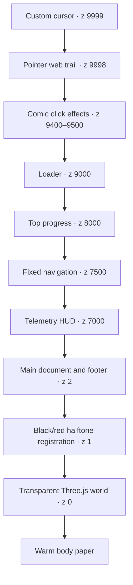

# Fable Portfolio Reverse Engineering

## Purpose

This document reconstructs the design logic, information architecture, component grammar, and implementation provenance of the portfolio. It is written so a future designer or coding agent can extend the site without reducing it to a superficial collection of red buttons, comic fonts, and random animation.

The exact motion and background mechanics live in [MOTION_BACKGROUND_ENGINE.md](MOTION_BACKGROUND_ENGINE.md). The implementation rules for adding features live in [FEATURE_EXTENSION_PLAYBOOK.md](FEATURE_EXTENSION_PLAYBOOK.md). The canonical visual system lives in [../DESIGN.md](../DESIGN.md).

## Sources and confidence

The analysis uses four forms of evidence:

1. The original one-file Fable artifact at `C:\Kaustubh\others\sarvesh-portfolio-HERO-WEB_2.html`.
2. The current split implementation in `index.html`, `assets/css/styles.css`, and `assets/js/main.js`.
3. Repository history from the initial commit through the current touch fix.
4. Runtime inspection at desktop and mobile sizes across the beginning, middle, and end of the scroll journey.

Facts derived directly from source are labeled as implementation facts. Statements about why the creator made a choice are reasoned inferences. No creator-supplied rationale was available.

## Executive conclusion

The current portfolio is not an independent recreation of the Fable design. It is the original Fable artifact split into three files, reformatted, rebranded, and selectively restyled. Nearly the entire visual and motion engine, including its geometry, coordinate values, timing values, interpolation factors, and easing choices, remains semantically unchanged.

This matters because the design quality is already encoded in a coherent system. The correct continuation strategy is not to approximate the screenshot with a new framework or add more spectacle. It is to preserve the existing narrative, material, spatial, and motion rules while improving the weak implementation contracts around accessibility, fallback behavior, performance, and feature semantics.

The central creative idea is:

> A serious AI systems builder presented as a web-slinging comic protagonist whose portfolio is one continuous hand-inked city journey.

Everything strong in the page reinforces that one idea:

- The loader climbs a tower, takes position, loads web fluid, inks the skyline, and becomes ready to fire.
- A crouched rooftop figure, moon, skyline, and double web are generated procedurally.
- Page scroll extends the web, moves its tip, shifts the camera, triggers checkpoints, fills progress, and updates the HUD.
- Pointer movement bends the scene, tilts the hero statement, leaves a cross-thread trail, and pulls controls magnetically.
- Clicks fire temporary red webs with recoil, splats, and comic impact words.
- Copy calls projects “case files,” interests a “signal stack,” and work a “build lab.”
- Visual surfaces behave like physical printed panels through ink borders, offset shadows, rotation, lift, and elastic return.

The page is highly authored because concept, content, image-making, interaction, and code architecture all point in the same direction.

## Provenance and source map

### Original one-file artifact

| Region | Original lines | Responsibility |
| --- | ---: | --- |
| Metadata and fonts | 1–10 | Document identity and four font families |
| Inline CSS | 11–211 | Tokens, layers, layout, components, responsive rules |
| DOM | 213–374 | Loader, canvases, navigation, hero, chapters, footer |
| CDN dependencies | 376–378 | Three.js r128, GSAP 3.12.5, ScrollTrigger 3.12.5 |
| Inline runtime | 379–874 | Procedural scene, scroll engine, animation, interaction |

### Current split implementation

| Current file | Current lines | Original responsibility |
| --- | ---: | --- |
| `index.html` | 15–188 | DOM formerly at original lines 215–374 |
| `assets/css/styles.css` | 1–204 | CSS formerly at original lines 11–211 |
| `assets/js/main.js` | 1–685 | Runtime formerly at original lines 379–874 |
| `index.html` | 190–193 | Same CDN order and versions plus local runtime |

The current project adds only a copy-based build wrapper in `package.json` and a local résumé PDF. It still has no framework, component runtime, bundler, router, data layer, or scene asset pipeline.

### Repository history

The repository’s initial portfolio commit, `23ce785`, already contains the complete core scene and interaction engine. Later commits refine rather than reinvent it:

| Commit | Material direction |
| --- | --- |
| `23ce785` | Initial portfolio with the complete Fable-derived visual and motion engine |
| `a2a6bb2` | Hosting-ready content and interaction cleanup; removed the top-left HUD and duplicate hero résumé action; revised contact behavior |
| `71ccca1` | Added Patrick Hand and stronger speech-panel treatment; adjusted spacing; replaced proof counters with static principles |
| `82c2867` | Added touch tap-versus-scroll discrimination before firing temporary webs |

The core procedural skyline, rooftop figure, moon, double web, camera traversal, cursor trail, click shots, marquees, scroll reveals, skew, card tilt, and magnetic buttons all predate these refinements.

## What changed and what did not

### Semantically unchanged engine

The following systems retain the original geometry, constants, timings, and behavior:

- Renderer, paper-colored fog, perspective camera, and initial framing.
- Random canvas window textures and eleven-building skyline.
- Distant silhouette row and four drifting cloud groups.
- Primitive crouched hero and rooftop perch.
- Giant moon, rings, and random crater marks.
- Ten-point Catmull-Rom web path with two concentric color strands.
- Four radial web checkpoints at 22%, 45%, 68%, and 90%.
- Global normalized scroll state and draw-range reveal.
- Inertial web progress and inertial camera follow.
- Pointer parallax, scene sway, and headline depth.
- Temporary click-fired web shots, splats, impact words, and recoil.
- Twenty-six-sample pointer web trail.
- Simulated loader and GSAP hero entrance.
- Scramble tag, standard reveals, flip reveals, velocity skew, card scrub.
- Custom cursor, magnetic controls, and 3D card tilt.

### Actual mechanical changes

The current version changes only a few runtime behaviors:

1. Touch input no longer fires at the beginning of every scroll gesture. It records a pointer start, rejects movement over `12px` and holds over `650ms`, and fires only a qualifying tap on pointer release. Mouse and pen still fire immediately.
2. The bottom HUD fades and moves down when the footer intersects.
3. Loader motion changed from a rotate-and-scale pulse to a smaller rotate-and-hop motion.
4. A few unused palette constants and punctuation characters were removed.

### Content and styling changes

- Sarvesh/Delhi/AI-builder-coach content became Kaustubh/Hyderabad/AI-systems-builder content.
- The top-left system HUD was removed.
- Navigation labels and the right-side action changed.
- The hero went from two actions to one and lost the explicit “SCROLL TO FIRE THE WEB” onboarding row.
- Marquee vocabulary changed while track structure and animation stayed the same.
- Biography plus animated proof counters became philosophy plus five static principles.
- Three service cards became three project case files while preserving card structure.
- Four chronological process steps became five topical focus rows.
- One social CTA row became email/résumé actions plus a two-by-two social grid.
- Patrick Hand became the short explanatory voice and paragraphs gained translucent bordered panels.

### Dormant code left behind

| Dormant feature | Remaining code | Missing counterpart |
| --- | --- | --- |
| Top-left HUD | `.hud-tl` and its corner marker in `styles.css:53,56` | No `.hud-tl` element in current DOM |
| Hero metadata | `.hero-meta`, `.scroll-hint`, `dropLine`, and launch target in `styles.css:104–107`, `main.js:541` | Original hero metadata row removed |
| Animated counters | `main.js:598–619` | Current `.num` elements have no `data-count` |
| Split-color wordmark | `.nav-logo span` in `styles.css:65` | Current logo contains no span |

Dormant selectors are not a design system. Do not revive them automatically. Either restore the original UX purpose deliberately or remove the dead path during a dedicated cleanup.

## Reconstructed design thought process

The following sequence best explains how the one-shot artifact achieved coherence.

### 1. Choose a concrete world before choosing components

The creator did not begin with “portfolio hero, cards, process, contact.” The stronger first decision was a world: city rooftops, a crouched web-slinger, printed ink, a moon silhouette, web firing, comic impacts, and case-file language.

That world then constrained every later choice. The result avoids the category-interchangeable look of a standard portfolio because it could not be relabeled as a finance app or agency site without rewriting its scene, copy, interaction, and motion.

### 2. Turn the background into the narrative mechanism

The skyline is not a passive backdrop. Scroll draws the central web, and the camera progressively transfers attention from the rooftop figure to the moving tip. This makes ordinary document progress feel like an action.

The original source even describes the intended scene as a clean composition containing a skyline, hero silhouette, and one epic web line. The restraint is important: one dominant line carries the journey; secondary effects support it.

### 3. Build the world from code-native primitives

No imported hero model, skyline illustration, background video, texture pack, or stock image is required. Buildings are boxes with generated canvas windows. The hero is assembled from twelve primitive meshes. Clouds are low-poly spheres. The moon is flat circles and rings. The web is a generated tube. Click splats are inline SVG.

This gives the world three advantages:

- It shares the same exact ink palette as the UI.
- Its geometry can react to scroll and pointer state directly.
- It looks constructed rather than sourced from a mismatched asset library.

### 4. Make the WebGL scene dissolve into the paper

The transparent renderer sits over the warm body color. Fog uses the same warm paper color, so distant geometry fades into the document instead of exposing a conventional 3D horizon. Halftone layers sit above WebGL but below text, making screen-rendered geometry feel printed.

This is why the background belongs to the foreground material system rather than looking like a separate game canvas.

### 5. Assign each typeface a speaking role

The typography is a cast of voices:

- Bangers speaks action and identity.
- JetBrains Mono speaks telemetry, file labels, and technical structure.
- Patrick Hand speaks human explanation in the current version.
- Archivo remains the neutral fallback for ordinary interface copy.

The same separation appears in the loader, HUD, navigation, chapter labels, cards, chips, and CTA copy. Reusing fonts by semantic voice is more important than simply retaining their names.

### 6. Make physical print behavior the component system

The surfaces share a small physical grammar:

- `3px` black outlines.
- `5px` to `9px` hard offset shadows.
- `14px` to `20px` corner radii.
- Resting rotations around half a degree.
- Hover lift that straightens the panel and increases the shadow.
- Back or elastic easing only when something behaves like a physical object.

This lets navigation actions, cards, rows, buttons, and social destinations belong to one material family even when their layouts differ.

### 7. Use many coordinated motions with different time scales

The page feels rich because motion has a hierarchy:

- Sub-second impacts for web shots, recoil, bursts, and cursor response.
- One-second entrances for readable content.
- Two-to-four-second idle movement for the hero and card glyphs.
- Fourteen-to-twenty-six-second atmospheric loops for halftones and marquees.
- Exponential interpolation for world and cursor inertia.

The richness does not come from making every element use the same dramatic reveal.

### 8. Organize content as a visitor decision sequence

The page tells a clear story:

```text
Identity → vocabulary → philosophy → evidence → technical direction → contact
```

Each content transition changes layout rather than repeating a universal card section:

- The hero is a full-viewport statement.
- Marquees are a scene cut.
- About is an editorial split.
- Work is a case-file panel.
- Focus is a stacked indexed list.
- Contact is a centered conversion block.

### 9. Let one state variable coordinate the whole journey

Normalized document progress drives the web, tip, camera, checkpoints, HUD, and progress bar. That single state spine is why the experience feels choreographed rather than like unrelated scroll plugins.

It also creates the main extension constraint: changing document height changes where every existing 3D event appears relative to semantic content.

## Hallmark design DNA record

| Dimension | Extracted DNA |
| --- | --- |
| Source mode | Local, user-provided original artifact plus live implementation |
| Primary macrostructure | Custom illustrated marquee hero followed by editorial chapters |
| Secondary spatial pattern | Persistent map/diagram world across the full document |
| Hero archetype | Closest to H9 Custom Illustration Centerpiece, but implemented as a fixed procedural Three.js stage behind oversized type |
| Navigation | Fixed wordmark + short system link row + right action; a denser variant than edge-aligned minimal |
| Footer | Inline-rule single line / minimal colophon |
| Theme family | Custom comic-print brutalism on warm paper |
| Density | Visually dense background, generous foreground chapter spacing |
| Asymmetry | Left-biased statement balanced by a right-side rooftop figure and moon |
| Type roles | Comic display, system mono, handwritten explanation, neutral fallback |
| Signature treatments | Halftone registration, hard extrusion, fixed procedural world, scroll-drawn double web, physical hover lift |
| Primary reveal language | Type unmask/flip, fade-up, camera move, draw-range extension |
| Refusal | No stock image collage, no glass dashboard, no generic bento hero, no separate animation theme per section |

The page is not a strict Hallmark Marquee Hero because it includes a subhead and CTA in the fold. Its closest accurate description is a custom illustrated marquee: the identity statement dominates the viewport while explanation and action remain subordinate.

## Information architecture

### Global navigation

Current labels map directly to page concepts:

| Label | Destination | Visitor question answered |
| --- | --- | --- |
| Style | `#about` | How does this person think? |
| Builds | `#work` | What has this person made? |
| Focus | `#process` | What technical territory matters now? |
| Contact | `#contact` | How can I act next? |

The fixed nav is visually quiet relative to the hero. It uses small system copy, a translucent paper strip, and one red external GitHub action.

### Content funnel

| Sequence | Section | Purpose | Layout primitive |
| ---: | --- | --- | --- |
| 0 | Hero | Positioning and primary action | Full-viewport statement over the scene |
| Transition | Paired marquees | Vocabulary and operating rhythm | Opposed diagonal tapes |
| 1 | Build Style | Philosophy and principles | 1.2/.8 editorial split |
| 2 | Featured Builds | Primary work evidence | Three case-file cards |
| 3 | Now Building Around | Current depth and interests | Indexed stacked rows |
| 4 | Contact | Conversion | Centered actions plus social grid |
| Close | Footer | Identity and location | Minimal two-item colophon |

The sequence reads as “who I am, how I think, what I built, where I am going, how to reach me.” That decision path should remain visible when adding new material.

## Layer architecture



| Layer | Source | Contract |
| --- | --- | --- |
| Paper | `styles.css:16–18` | Stable warm ground and selection ink |
| WebGL world | `styles.css:49`, `main.js:4–246` | Fixed, transparent, non-interactive spatial stage |
| Halftone registration | `styles.css:21–28` | Fixed texture, pointer-transparent, subordinate opacity |
| Foreground document | `styles.css:76–80`, `index.html:48–188` | Semantic content and readable opaque surfaces |
| HUD/navigation/progress | `styles.css:51–74` | Fixed orientation and system feedback |
| Loader and impacts | `styles.css:38–47,193–196` | Temporary foreground narrative events |
| Pointer system | `styles.css:30–36`, `main.js:464–508,633–665` | Fine-pointer enhancement only |

New overlays must declare where they belong. A project drawer, for example, should sit above navigation and below cursor effects, use an opaque paper surface for readability, trap focus, and pause background interaction while open.

## Visual system

### Color

The visible palette is deliberately small:

| Role | Token | Value | Typical use |
| --- | --- | --- | --- |
| Primary stock | `--paper` | `#FBFAF5` | Page, cards, controls, fog |
| Secondary stock | `--paper-2` | `#F2EFE6` | Chips and quiet separation |
| Ink | `--ink` | `#15151C` | Text, borders, silhouettes, shadows |
| Quiet ink | `--ink-soft` | `#4A4A58` | HUD and secondary copy |
| Action | `--red` | `#E0202F` | Primary CTA, web, progress, accents |
| Deep action | `--red-deep` | `#B30E1E` | Extrusion and emphasized display words |
| System | `--blue` | `#2342D6` | Technical accent and contrast |
| Deep system | `--blue-deep` | `#16289B` | Extrusion and shadow |
| Signal | `--yellow` | `#FFC400` | Stars, bursts, selection, sparks |

Measured contrast against `#FBFAF5` is strong for the main roles:

- Inking Black: approximately `17.38:1`.
- Caption Graphite: approximately `8.33:1`.
- System Blue: approximately `7.12:1`.
- Action Red: approximately `4.55:1`.
- White on Action Red: approximately `4.75:1`.

Small future metadata should use ink or blue rather than shrinking red copy below its current sizes.

### Typography

| Voice | Family | Current locations | Extension rule |
| --- | --- | --- | --- |
| Action | Bangers | Hero, H2, CTAs, cards, numerals, social labels | Keep short, uppercase, and wide |
| System | JetBrains Mono | Nav, hero tag, eyebrows, chips, HUD | Use for real metadata, not decoration |
| Human note | Patrick Hand | Hero panel, about, project copy, focus copy | Keep concise; use Archivo for sustained reading |
| Neutral UI | Archivo | Body base and structural fallback | Use for dense case studies, forms, tables, documentation |

Hero display uses `clamp(60px, 12vw, 180px)` at a `0.92` line height. Chapter titles use roughly `clamp(40px, 6.5vw, 86px)`. System labels stay around `9px` to `12px` with wide tracking. The contrast between these scales is intentional.

### Material and geometry

- Surfaces are flat paper, not translucent glass. Only explanation panels use modest backdrop blur to protect text over the city.
- Structural borders are usually `3px` black.
- Shadows are hard offsets with zero blur.
- Resting rotations stay near `±0.5°` to `±1°`.
- Cards use a `20px` radius, rows `18px`, social tiles `16px`, controls `14px`, and chips `5px`.
- Display depth comes from red/blue offset ink and z-separated type rows.
- Halftone dots are regular registration patterns rather than photo grain.

### Composition rhythm

The foreground uses generous chapter padding, then changes primitive at every major transition. The background remains spatially continuous. This tension between a stable world and changing editorial structures is a core design feature.

Future sections should not default to another three-column card grid. Choose a structure based on the information:

- Long evidence: editorial case-study spread.
- Sequence: indexed rows or a route diagram.
- Comparison: split field or matrix.
- Live demo: focused console or instrument panel.
- Short verified proof: compact stamps or a single evidence rail.

## Component grammar

### Fixed navigation

**Anatomy:** wordmark, four anchor labels, one external GitHub action.

**Visual contract:** translucent paper strip, mono labels, red right action, hard bottom edge through visual contrast rather than a heavy container.

**Responsive contract:** center links disappear below `760px`, leaving wordmark and action.

**Current weakness:** mobile receives no replacement menu or section index. A future navigation change should preserve the quiet header but restore access through a compact drawer, chapter index, or other keyboard/touch-friendly mechanism.

### Hero

**Anatomy:** system tag, three 3D display rows, handwritten speech panel, one primary action, fixed world behind.

**Hierarchy:** headline first, explanatory panel second, action third. The procedural rooftop figure and moon balance the left-heavy statement.

**Refusal:** no metric strip, product screenshot, dashboard preview, secondary CTA cluster, or stock portrait in the fold.

**Onboarding gap:** the original explicitly said “SCROLL TO FIRE THE WEB.” The current version removed this instruction while retaining a visually unusual progress mechanism. The journey is still understandable through motion, but discoverability of click firing and the web metaphor is weaker.

### Paired marquees

The marquees are a chapter transition, not a reusable announcement component. Their exact oppositions matter:

- Black and red surfaces.
- `-1.2°` and `+1°` rotations.
- Forward and reverse directions.
- `22s` and `26s` linear periods.
- Yellow star or dot punctuation.

Do not add another marquee elsewhere. Repetition would turn a strong scene cut into a generic ticker motif.

### Chapter heading

Each top-level chapter uses one numbered mono eyebrow plus one oversized display statement with one red or blue phrase. The pattern works because it appears only four times and marks real changes in information mode.

Do not propagate numbered eyebrows into cards, nested subheadings, filters, or modal panels.

### Principles

Five static principle tiles replace the original proof counters. They are visually organized as two columns with a full-width fifth item. They communicate philosophy, not verified achievement.

If verified metrics return, they should be presented as evidence with sources rather than reviving animated counters solely because the code still exists.

### Project case files

**Anatomy:** case badge, glyph, title, explanation, chip row.

**Motion:** reveal, alternating scroll offset, pointer tilt, z-separated inner layers, local yellow light.

**Highest-priority UX gap:** cards are non-semantic `div` elements and do not lead to a repository, demo, or case study. Their cursor and tilt behavior implies clickability, while the primary “View Builds” action only scrolls to them. When real destinations exist, each case file should become one semantic link or include one clearly named action.

**Visual debt:** project glyphs are emoji. Future additions should use custom inline SVG or code-native marks so platform-dependent emoji rendering does not weaken the authored system.

### Focus rows

Rows use a `110px / 1fr / 1.2fr` grid, extruded number, action heading, and handwritten explanation. Alternating resting rotation creates a physical stack; hover squares and lifts the row.

The markup currently jumps from H2 to H4. Future work should use H3 for row titles and correct existing hierarchy during a dedicated accessibility pass.

### Contact and social destinations

The contact chapter correctly establishes email as primary and résumé as secondary. Social tiles are visible and labeled rather than icon-only.

The email action currently opens a Gmail compose URL. That excludes visitors without a usable Gmail session. A universal `mailto:` or an accessible contact surface would be more reliable while preserving the same visual component.

### Footer

The footer is a deliberately minimal colophon: identity on one side, location on the other, with a top rule. It should remain quiet and should not become a second sitemap unless the site gains multiple routes.

## Interaction and motion grammar

The exact formulas are documented separately. The transferable vocabulary is:

| Motion family | Easing | Purpose |
| --- | --- | --- |
| Readable entrance | `power3.out`, `power4.out` | Content and camera comprehension |
| Comic snap | `back.out` | Headline rows, checkpoints, bursts |
| Physical return | `elastic.out` | Magnetic controls and card tilt |
| Ambient breath | `sine.inOut` or slow sine functions | Hero, moon, glyphs |
| Mechanical tape | `linear` | Marquees |
| Inertial follow | Exponential interpolation | Web, camera, cursor |

Motion is strongest when it has a cause:

- Scroll stretches the web and bends the paper.
- Pointer position changes parallax and tilt.
- Press fires a strand and causes recoil.
- Hover lifts a printed surface.
- Leaving releases a magnet or tilted panel.

Do not use elastic easing for ordinary navigation, filtering, form validation, or state confirmation. Those are comprehension events, not comic impacts.

## Responsive behavior

### Current breakpoint map

| Width/input condition | Current adaptation |
| --- | --- |
| No hover | Hide custom cursor and pointer web trail; restore native cursor |
| `≤980px` | Stack three project cards into one column |
| `≤900px` | Stack about text and principles |
| `≤860px` | Hide fixed HUD; keep social grid at two columns |
| `≤760px` | Hide center nav links; stack focus rows |
| `≤460px` | Stack social destinations into one column |

Runtime inspection at `390×844` showed no horizontal overflow in the current page. Hero type, speech panel, card stack, focus rows, and contact actions remain legible. The fixed HUD and custom cursor correctly disappear.

### Current responsive risks

- Project cards jump directly from three columns to one at `980px`; there is no deliberate tablet two-column stage.
- Mobile navigation hides all in-page destinations.
- `overflow-x:hidden` masks transformed overflow and can clip focus outlines.
- WebGL complexity remains unchanged on mobile.
- Hover tilt and magnetic listeners are not explicitly gated by coarse pointer, even though the visible custom cursor is.
- Long titles, long chip values, localization, 200% zoom, and extreme narrow widths have no authored rules.

### Responsive continuation principle

Do not treat mobile as desktop with stacked grids. Preserve the same information hierarchy but reduce interaction density:

- Native cursor and stable touch surfaces.
- Shorter or static atmospheric loops.
- One-column reading flow.
- Explicit chapter access.
- Fewer concurrent transforms.
- Foreground legibility over scene detail.

## Accessibility and resilience audit

These findings describe current debt; they are not instructions to discard the art direction.

### Highest priority

1. There is no authored `:focus-visible` treatment for navigation, CTAs, or social links.
2. Project cards look interactive but are non-semantic and non-focusable.
3. Mobile navigation removes the section controls instead of adapting them.
4. The page has no safe no-JavaScript or CDN-failure state. The loader removal depends on runtime execution, and several important elements begin invisible.
5. Reduced-motion behavior is incomplete. The main scene loop stops, but the infinite headline bob, global skew, card/magnetic behaviors, and hidden RAF loops remain active.

### Semantic and assistive-technology issues

- The process rows skip heading level from H2 to H4.
- Duplicated marquee content and decorative separators are exposed to assistive technology.
- Decorative canvases, halftones, HUD, and pointer layers are not consistently marked hidden.
- The loader has no status role or live region and is unrelated to actual loading.
- Some inline social SVGs are not consistently hidden from assistive technology.
- There is no skip link, current-section state, or anchor `scroll-margin-top` for the fixed header.
- The smooth-scroll preference is not disabled under reduced motion.

### Resilience issues

- Three.js, GSAP, ScrollTrigger, and Google Fonts are external runtime dependencies.
- If a CDN dependency fails before `main.js` runs successfully, the loader can remain blocking and reveal content can remain invisible.
- The simulated loader is not tied to dependency, font, or WebGL readiness.
- The scene is randomized, so exact screenshot regression tests differ on every load.

## UX strengths and weaknesses

### What works

- One primary hero action reduces competition.
- Navigation names match the actual conceptual chapters.
- Copy, UI, world, and microcopy share one metaphor.
- The page progresses from identity to evidence to action.
- Contact ends with a clear primary/secondary pair and visible social labels.
- Touch scroll no longer accidentally fires webs.
- Fluid type, fluid gutters, and collapsing grids create a workable mobile base.

### What weakens conversion or comprehension

1. **The strongest proof is not actionable.** Case files lack demo, repository, or detailed case-study destinations.
2. **External validation was reduced.** Static philosophy replaced active proof counters, but no sourced evidence took their place.
3. **“WEB FIRED” is semantically ambiguous.** It displays inertial scroll/web progress rather than the count of click-fired webs.
4. **The loader promises progress it does not measure.** Randomized increments communicate theme but not actual readiness.
5. **Email assumes Gmail.** The current link is less universal than a normal mail action.
6. **The current version removed the explicit web onboarding.** Visitors discover click firing only by accident.

These are the most valuable targets for future product work because they improve user outcome without changing the visual identity.

## Why this one-shot feels stronger than a typical recreation

The Fable artifact made several high-leverage decisions in one pass:

1. It solved concept and implementation together. The superhero/web idea immediately suggested the scene, copy, loader, scroll state, cursor, and impact effects.
2. It used one shared state spine rather than separate scroll animations per section.
3. It generated visual assets from the same color and geometry system as the UI.
4. It varied layout primitives while preserving material rules.
5. It assigned different motion speeds to atmosphere, comprehension, input response, and impact.
6. It allowed intentional imperfection through halftones, rotations, random windows, and print offsets.
7. It kept the stack technically small: semantic HTML, CSS, Three.js, GSAP, and ScrollTrigger.

A weaker recreation often copies only the visible nouns—Bangers, red, cards, Three.js—without preserving the causal relationships. The result may contain the same ingredients but lacks the governing idea.

The correct instruction to a future coding model is not “make this more premium” or “add cinematic animations.” It is:

> Preserve the Web-Slung Build Lab as one continuous physical world. Make the new feature advance a visitor decision, express it through the existing print material and type roles, and give it one interaction whose cause belongs to the web/case-file/build-lab narrative.

## Known implementation debt

### Motion and rendering

- Web and camera interpolation factors are frame-based, so motion is faster on high-refresh displays.
- The full-screen renderer remains active across the entire page at up to `2×` DPR.
- Static scene construction creates roughly 159 potential draw calls.
- WebGL, cursor, trail, and GSAP loops do not pause when the document is hidden.
- The full document `.skew-wrap` permanently requests transform optimization.
- Cursor ring tracking reads layout and writes transform every animation frame.
- Pointer movement can create many overlapping GSAP tweens.
- Fired web geometry is disposed, but each unique material is not.
- Scene randomness prevents deterministic visual snapshots.
- Restored nonzero scroll is not sampled at startup until the first scroll event.
- The click handler also reacts to non-primary desktop pointer presses and clicks on ordinary links.

### Transform ownership

- The hero entrance tween and camera follow loop both write camera position during the first `2.6s`.
- Card `.reveal` and card scrub both write vertical translation.
- Magnetic GSAP transforms can replace CSS button lift/rotation transforms.

Future changes should establish one owner per transform channel or compose values through CSS variables and parent/child wrappers.

### Token ownership

Colors exist as CSS custom properties but are also repeated as raw JS numbers and scattered SVG values. A future refactor can expose one JavaScript palette derived from CSS or a shared generated token source. That work should preserve exact visible colors.

## Invariants for future work

Preserve these unless the user explicitly asks for a new art direction:

- One continuous superhero/web/build-lab narrative.
- Warm paper, black ink, red action, blue system, yellow signal.
- Bangers action voice, mono system voice, human or neutral explanatory voice.
- Fixed procedural world beneath semantic foreground content.
- Hero/right and moon/right composition with web travel toward the left.
- Hard outlines, offset shadows, shallow rotations, and flat print color.
- Physical motion with distinct time scales and causal input.
- Generous chapters with varied information structures.
- One hero-scale moment; later sections remain subordinate.
- Scroll progress as an explicitly managed shared state.

Do not inherit these defects merely because they are present:

- Fake resource progress.
- Invisible content when animation libraries fail.
- Hover-only affordances.
- Hidden mobile navigation.
- Unconditional animation under reduced motion.
- Non-actionable cards that look clickable.
- Platform-dependent emoji as permanent project marks.
- Raw color duplication across rendering layers.
- Another equal three-card section or another marquee by default.
- More WebGL that does not serve narrative or user outcome.

## Source index

Use these locations before changing a subsystem:

| Subsystem | Current source | Original source |
| --- | --- | --- |
| Palette and base material | `assets/css/styles.css:1–19` | Original `12–29` |
| Halftones | `styles.css:21–28` | Original `32–39` |
| Cursor and pointer trail | `styles.css:30–36`, `main.js:464–508,633–665` | Original `42–48,722–747,835–857` |
| Loader | `styles.css:38–47`, `main.js:510–544` | Original `51–60,749–774` |
| Layer stack and HUD | `styles.css:49–61`, `main.js:248–269` | Original `62–74,574–585` |
| Navigation | `index.html:32–46`, `styles.css:63–74` | Original `233–241,77–87` |
| Hero | `index.html:51–64`, `styles.css:84–107`, `main.js:529–582` | Original `248–266,97–120,776–805` |
| Marquees | `index.html:66–77`, `styles.css:109–117` | Original `270–280,123–131` |
| Chapters and headings | `index.html:79–181`, `styles.css:76–82,119–189` | Original `284–366,134–194` |
| Renderer and camera | `main.js:4–16` | Original `388–399` |
| Skyline and clouds | `main.js:18–116` | Original `402–467` |
| Hero and moon geometry | `main.js:118–175` | Original `469–515` |
| Persistent web | `main.js:177–246` | Original `517–572` |
| Scroll state and camera follow | `main.js:248–276,378–462` | Original `574–592,645–720` |
| Click-fired web | `main.js:278–376` | Original `594–643` plus current touch fix |
| GSAP reveal choreography | `main.js:584–631` | Original `807–833` |
| Magnetic and card tilt | `main.js:667–685` | Original `858–873` |

## Completion standard for understanding

A future contributor understands this design only if they can answer all of the following without guessing:

1. Why does the distant skyline fade into paper rather than into a sky color?
2. Which state is immediate scroll progress and which state is inertial web progress?
3. Why does adding ordinary content change the semantic timing of the camera journey?
4. Which font speaks action, system metadata, human explanation, and dense neutral copy?
5. Why are hard shadows and shallow rotations more important than any single card layout?
6. Which continuous animations are atmospheric and which sub-second motions represent impacts?
7. Where should a new overlay sit in the z-index hierarchy?
8. Which existing patterns are intentional signatures and which are implementation debt?
9. How will the feature help a visitor make a decision or complete an action?
10. How does the feature behave with keyboard input, coarse pointer, reduced motion, no WebGL, and a failed CDN?

If those answers are explicit, the site can evolve without losing the intelligence of the original one-shot.
