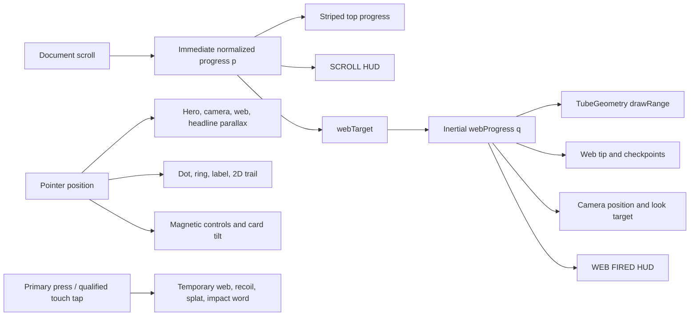

# Motion and Background Engine

## Purpose

This is the technical source of truth for the portfolio’s procedural background, global scroll journey, pointer physics, and motion language. It describes the current implementation exactly enough to maintain or refactor it without changing its visible direction.

All current line references point to `assets/js/main.js` or `assets/css/styles.css`. Original references point to `C:\Kaustubh\others\sarvesh-portfolio-HERO-WEB_2.html`.

## System overview

The experience is driven by one shared narrative state:



The persistent world remains fixed while the semantic document moves over it. The scene is never reset between chapters.

## 1. Compositing and depth

| Order | Element | z-index | Source |
| ---: | --- | ---: | --- |
| 0 | Body newsprint | auto | `styles.css:16–18` |
| 1 | Transparent fixed WebGL canvas | 0 | `styles.css:49` |
| 2 | Black/red fixed halftones | 1 | `styles.css:21–28` |
| 3 | Main document and footer | 2 | `styles.css:76–80,191` |
| 4 | Telemetry HUD | 7000 | `styles.css:51–58` |
| 5 | Fixed navigation | 7500 | `styles.css:63–74` |
| 6 | Top progress | 8000 | `styles.css:60–61` |
| 7 | Loader | 9000 | `styles.css:38–47` |
| 8 | Web splats and impact words | 9400–9500 | `styles.css:193–196` |
| 9 | 2D pointer trail | 9998 | `styles.css:35` |
| 10 | Cursor dot, ring, label | 9999 | `styles.css:30–34` |

The DOM contains the WebGL canvas, 2D trail canvas, halftones, progress, and HUD before the navigation and semantic main content at `index.html:21–49`.

### Why this composition works

- WebGL uses alpha, so the body remains the authoritative paper color.
- Fog uses the same paper value, causing distant geometry to dissolve into the document rather than exposing a separate sky.
- Halftone overlays sit above geometry, visually registering it to the print surface.
- Foreground panels selectively restore opaque paper where text needs contrast.
- All cinematic layers have `pointer-events:none`; semantic DOM remains the interaction surface.

## 2. Renderer, fog, and camera

Current setup at `main.js:4–13`:

```text
Renderer: WebGLRenderer({ antialias: true, alpha: true })
Pixel ratio: min(devicePixelRatio, 2)
Clear: transparent
Scene fog: #FBFAF5, near 26, far 60
Camera: PerspectiveCamera(55°, aspect, 0.1, 200)
Initial position: (0, 5, 14)
Initial look target: (2, 3, 0)
```

There are no lights and no physically based shadows. Geometry uses flat `MeshBasicMaterial`, outline meshes, fog, and layered planes. The intention is a graphic illustration, not realistic rendering.

### Design invariant

If new scene geometry is added, it should read correctly through silhouette, flat fill, outline, and depth placement. Do not add an isolated physically lit model with glossy materials into the scene.

## 3. Generated skyline

### Window texture

`windowTexture(width, height)` at `main.js:18–42` creates a `64×128` canvas:

1. Fill the canvas with warm paper `#F2EFE6`.
2. Iterate a `9×4` logical window grid.
3. Give each cell a `72%` chance of using ink `#15151C`; otherwise use light yellow `#FFE28A`.
4. Draw a `4×7` rectangle for each window.
5. Convert to `CanvasTexture` with nearest-neighbor filtering.
6. Repeat horizontally and vertically according to building size:

```text
repeatX = max(1, round(width / 1.4))
repeatY = max(1, round(height / 2.4))
```

Every page load generates different window illumination.

### Near skyline

Eleven hand-positioned building definitions at `main.js:45–79` provide `x`, `width`, `height`, and `z` values. For each building:

- Create a paper-textured `BoxGeometry`.
- Align its base to world `y = -4.5` using `y = -4.5 + height / 2`.
- Add black `EdgesGeometry` with opacity `0.72`.
- Add a black roof ledge.

Building index `6` is the hero tower. Its key values are:

```text
x = 7.8
width = 4.0
height = 12.5
z = -1.4
```

### Far skyline

Sixteen translucent ink planes at `z = -16` create the distant city (`main.js:81–92`). Their height and x placement include randomness. Fog and low opacity make them feel like faded registration layers.

### Clouds

Four cloud groups at `main.js:94–116` each contain four low-poly sphere meshes plus faint edge outlines. Each cloud stores a random horizontal speed from approximately `0.08` to `0.20` world units per second. In the main loop:

```text
cloud.x += speed × dt
if cloud.x > 22: cloud.x = -22
```

Cloud movement is time-based, unlike web and camera smoothing.

## 4. Rooftop figure and moon

### Hero construction

The figure at `main.js:118–156` is assembled from twelve primitive meshes sharing one black material. A helper accepts geometry, position, rotation, and scale. The group includes a sphere head and simple body/limb primitives arranged in a crouched firing pose.

The group is scaled to `2.2`, rotated around Y by `2.75` radians, and placed on the hero tower. Its approximate perch is:

```text
(7.8, 8.25, -1.4)
```

The local firing hand point is:

```text
(0.98, 1.62, 0.05)
```

`handWorld()` updates the group matrix and converts this local point into world space. At the initial pose it resolves to approximately:

```text
(5.85, 11.81, -2.32)
```

This point anchors both the persistent scroll web and every temporary click-fired shot.

### Hero ambient motion

In `tick()`:

```text
hero.y = perch.y + sin(1.6t) × 0.04
hero.rotationY = 2.75 + sin(0.5t) × 0.05 + pointerX × 0.15
```

The movement is deliberately tiny. The pose remains a silhouette while still feeling alive.

### Moon

The moon at `main.js:158–175` consists of:

- A cream circle with radius `4.6`.
- A black ring from `4.6` to `4.78`.
- A larger faint ring from `5.1` to `5.16`.
- Seven random crater circles and matching outlines.

It sits at approximately `(8.4, 10.85, -7.9)`, behind the hero. Each frame it faces the camera and pulses:

```text
scale = 1 + sin(1.2t) × 0.015
```

The right-side moon and figure balance the left-heavy hero typography.

## 5. Persistent web geometry

### Curve

`buildWebCurve()` at `main.js:179–196` constructs a centripetal Catmull-Rom curve through the live hand point and nine hand-authored points:

| Index | x | y | z | Spatial purpose |
| ---: | ---: | ---: | ---: | --- |
| 0 | firing hand | firing hand | firing hand | Physical origin |
| 1 | 3.5 | 11.8 | -2.0 | Clean exit from the pose |
| 2 | 0.0 | 10.6 | -3.0 | First leftward sag |
| 3 | -3.8 | 12.3 | -4.5 | Upward counter-arc |
| 4 | -7.5 | 8.2 | -3.5 | Deep lower sweep |
| 5 | -12.0 | 10.2 | -5.0 | Midpoint recovery |
| 6 | -17.0 | 6.0 | -3.0 | Second lower sweep |
| 7 | -22.5 | 8.8 | -5.0 | Far recovery |
| 8 | -27.8 | 3.5 | -2.5 | Final descent |
| 9 | -33.0 | 5.5 | -4.0 | Far-left destination |

The x progression is consistently leftward while y and z alternate. That makes the path read as a hand-drawn swing rather than a straight progress line.

### Double thread

Two `TubeGeometry` meshes share the curve:

```text
Tubular segments: 900
Radial segments: 6
Black radius: 0.045
Red radius: 0.016
Red offset: +0.09 on Y
```

The geometry is precomputed once. Approximate full-tube cost per strand is `6,307` vertices and `32,400` indices. Both start with draw range zero.

The smaller offset red tube is not a glow. It is a second printed registration thread, preserving the flat ink language.

## 6. Scroll state and reveal math

### Immediate progress

The scroll handler at `main.js:254–260` computes:

```text
p = document.scrollTop / (document.scrollHeight - document.clientHeight)
```

It then:

- Assigns `p` to `webTarget`.
- Sets the top progress width to `100p%`.
- Updates the `SCROLL` HUD with rounded `100p`.

The scroll listener is passive.

### Inertial web progress

Each rendered frame applies:

```text
q[n+1] = q[n] + 0.08 × (p - q[n])
```

where `q` is `webProgress` and `p` is `webTarget`.

At `60Hz`:

- Half-life: `ln(0.5) / ln(0.92) ≈ 8.31` frames, about `139ms`.
- Time to 95%: `ln(0.05) / ln(0.92) ≈ 35.93` frames, about `599ms`.

The formula is frame-rate dependent. At a higher refresh rate, the same number of frames passes sooner, so the web feels faster.

### Draw range

```text
visibleSegments = floor(900 × q)
visibleIndices = visibleSegments × 6 × 6
```

The factor `6 × 6` is radial segments times triangle-index count per tubular segment. Both black and red strands receive the same draw range.

Changing only `drawRange` avoids rebuilding the tube on every scroll event.

### Initial-state caveat

`webTarget` begins at zero and is updated only by a scroll event. If a browser restores the page at a nonzero scroll position without firing the expected event immediately, the world can begin at the origin until the next scroll input. A future refactor should sample progress during initialization.

## 7. Tip and checkpoint mechanics

### Tip

The moving tip samples:

```text
tp = curve.getPointAt(clamp(q, 0.001, 0.999))
```

Clamping to `0.001` means it stays near the firing hand even when the tube draw range is empty.

Tip animation:

```text
sphereScale = 1 + sin(8t) × 0.18
ringRotationZ = 3t
ringRotationY = 2t
ringScale = 1 + sin(5t) × 0.12
webRotationZ = sin(0.8t) × 0.012 + pointerY × 0.02
```

### Checkpoints

Four checkpoints are placed at curve proportions:

```text
0.22, 0.45, 0.68, 0.90
```

Each checkpoint is a group of ten spokes and three visible rings. A floating-point loop written as `for (r = .25; r < .75; r += .2)` produces rings around `.25`, `.45`, and `.65`.

Behavior:

- Begin at scale zero.
- When `q` exceeds the threshold, scale to one over `0.6s` with `back.out(2.5)`.
- When scrolling backward, retract only after `q < threshold - 0.03`.
- Face the camera every frame.

The `0.03` hysteresis prevents rapid toggling at a boundary.

### Semantic pacing consequence

Checkpoint values are global document percentages, not section anchors. A checkpoint has no inherent relationship to About, Work, Focus, or Contact. That relationship exists only because current content height happens to place them near useful points.

Any material height change must be tested against all four checkpoint appearances.

## 8. Camera journey

### Desired camera position

For current tip point `tp`:

```text
followX = lerp(0, tp.x × 0.55, q)
followY = lerp(5, 2.5 + tp.y × 0.35, q)
followZ = lerp(14, 15.5, q)
```

Pointer parallax then adds:

```text
desiredX += pointerX × 1.6
desiredY -= pointerY × 1.0
```

Since normalized pointer coordinates span `-0.5` to `0.5`, maximum camera offsets are approximately `±0.8` world units horizontally and `±0.5` vertically.

### Camera smoothing

Each axis uses:

```text
camera += 0.05 × (desired - camera)
```

At `60Hz`:

- Half-life: `ln(0.5) / ln(0.95) ≈ 13.51` frames, about `225ms`.
- Time to 95%: `ln(0.05) / ln(0.95) ≈ 58.40` frames, about `973ms`.

This is also frame-rate dependent.

### Look target

```text
lookStart = (perch.x - 4.6, perch.y - 2.2, perch.z)
lookAlpha = min(1, 1.25q + 0.05)
lookTarget = lerp(lookStart, tp, lookAlpha)
camera.lookAt(lookTarget)
```

The camera begins by framing the hero and transfers authority to the tip faster than the position reaches its final follow state.

### Entrance conflict

The hero launch timeline also tweens `camera.position` from `y=8,z=24` over `2.6s`, while the render loop writes camera position every frame. These are competing owners. The current visual result works through incidental GSAP/runtime ordering, but a refactor should separate:

- A camera rig for scroll follow.
- A child camera or entrance offset for launch motion.

## 9. Loader and launch lifecycle

### Startup order

1. Construct the Three.js scene synchronously.
2. Start the pointer trail and cursor RAF loops.
3. Start CSS loops and the infinite GSAP headline bob.
4. Register ScrollTriggers.
5. Start a simulated loader interval.
6. When simulated progress reaches 100%, wait `400ms` and call `launch()`.
7. Fade the loader over `0.9s`, begin `tick()`, and run the hero entrance unless reduced motion is set.

### Simulated progress

Every `110ms`:

```text
progress = min(100, progress + random(0, 14))
```

Status strings advance through:

1. `CLIMBING THE TOWER...`
2. `TAKING POSITION...`
3. `LOADING WEB FLUID...`
4. `INKING THE SKYLINE...`
5. `READY TO FIRE!`

The loader is thematically strong but operationally false. It does not wait for fonts, Three.js, GSAP, ScrollTrigger, WebGL readiness, or another asset.

### Entrance timeline

| Target | Start | Duration | Ease |
| --- | ---: | ---: | --- |
| Camera from `y=8,z=24` | `0s` | `2.6s` | `power3.out` |
| Three hero rows, stagger `0.15s` | `0.2s` | `1.4s` each | `back.out(1.4)` |
| Hero tag | `0.5s` | `1s` | timeline `power4.out` |
| Hero subtitle | `1s` | `1s` | timeline `power4.out` |
| Hero actions | `1.2s` | `1s` | timeline `power4.out` |
| Dormant hero metadata target | `1.4s` | `1s` | timeline `power4.out` |

The `0.9s` loader fade overlaps the entrance, revealing the first motion through dissolving paper.

### Text scramble

The hero tag scramble runs `40` timer frames at `30ms` each, totaling `1.2s`. Characters resolve from left to right while unresolved positions sample a compact punctuation/digit alphabet.

## 10. DOM scroll choreography

### Reveal

Elements with `.reveal` begin at opacity zero and `translateY(60px)`. When their top reaches `88%` of the viewport, GSAP animates them to the visible state over `1.1s` with `power3.out`.

### Flip reveal

Elements with `.flip3d` begin at opacity zero, `rotateX(-85deg)`, and `translateY(40px)`. At `86%` viewport entry they animate over `1.3s` with `back.out(1.5)` and a `900px` perspective.

### Dormant count-up

The runtime still creates count-up behavior for `.num[data-count]`, entering at `90%` viewport height and animating for `2s` with `power2.out`. Current principle markup has no `data-count`, so the selection is empty.

### Global velocity skew

ScrollTrigger reports scroll velocity. The entire `.skew-wrap` receives:

```text
skewY = clamp(-4, 4, velocity / -450) degrees
```

The effect saturates at a speed magnitude of `1800px/s`, then returns to zero over `0.7s` with `power3.out`.

This makes the foreground behave like one flexible printed sheet. It also places a transform and `will-change` on an extremely tall element.

### Card scroll offset

Cards begin with alternating vertical offsets:

```text
card 1: -24px
card 2: 60px
card 3: -24px
```

They scrub to zero while the card group travels from `95%` to `30%` of viewport height, with `scrub:1`.

Cards also carry `.reveal`, which writes the same vertical transform channel. The two animations currently compete.

## 11. Marquee mechanics

Both tracks duplicate their full content so a `50%` translation loops without a seam.

| Track | Transform | Period | Direction |
| --- | --- | ---: | --- |
| Black | `rotate(-1.2deg) scale(1.02)` | `22s` | `0 → -50%` |
| Red | `rotate(1deg) scale(1.02)` | `26s` | `-50% → 0` |

The small overscale prevents rotated edges from exposing background gaps. Opposed angle, color, direction, and speed make the pair feel like a scene cut.

## 12. Pointer and interaction physics

### Normalized pointer

```text
pointerX = clientX / viewportWidth - 0.5
pointerY = clientY / viewportHeight - 0.5
```

This state affects hero yaw, camera position, web rotation, and hero statement tilt.

### Hero statement depth

The three `.row` elements receive z-depths:

```text
row 1: 0px
row 2: 38px
row 3: 76px
```

Pointer tilt:

```text
rotateY = pointerX × 14°
rotateX = -pointerY × 10°
```

Maximum values are `±7°` Y and `±5°` X. GSAP follows over `0.8s` with `power2.out`. The entire block also bobs upward `8px` over `2.6s`, yoyo, with `sine.inOut`.

### Custom cursor

The red dot follows the pointer exactly. The ring uses:

```text
ringNext = ringCurrent + 0.18 × (pointer - ringCurrent)
```

At `60Hz`, its half-life is about `58ms` and its 95% response time about `252ms`.

Hover expands the ring from `44px` to `86px`, changes the border to red, and adds a translucent fill over `0.25s`. A separate Bangers label appears for elements with `data-label`.

The loop calls `getBoundingClientRect()` and writes a transform every frame, which can force style synchronization.

### 2D pointer web trail

The trail canvas keeps the latest `26` pointer-event samples. It does not age them by time.

For sample index `i`:

```text
fade = 1 - i / trailLength
redAlpha = fade × 0.5
lineWidth = fade × 3
```

Every fifth sample receives a perpendicular cross-thread. Its half-length is `7 × fade`, derived from the local segment normal.

Consequences:

- A stationary pointer leaves its last trail visible indefinitely.
- The canvas uses CSS-pixel resolution rather than DPR scaling, reducing cost but softening lines on high-density displays.

### Magnetic controls

Within a `.magnetic` control:

```text
translationX = 0.32 × (pointerX - controlCenterX)
translationY = 0.32 × (pointerY - controlCenterY)
```

GSAP follows over `0.4s`. Pointer leave returns over `0.6s` with `elastic.out(1, 0.4)`.

GSAP’s inline transform can replace the CSS hover transform on the same button. Future work should move magnetic translation to an inner wrapper or CSS custom properties.

### Card tilt and local light

Within a card:

```text
px = localPointerX / cardWidth
py = localPointerY / cardHeight
rotateY = (px - 0.5) × 16°
rotateX = (0.5 - py) × 16°
```

Maximum tilt is `±8°`. CSS variables `--mx` and `--my` place a `500px` yellow radial light under the pointer. Card internals use z translations from `20px` through `56px`. Leave returns over `0.8s` with `elastic.out(1, 0.5)`.

## 13. Click-fired web

### Input conversion

Screen position is converted to normalized device coordinates and unprojected through the live camera:

```text
ndc = (2x / width - 1, 1 - 2y / height, 0.5)
direction = normalize(unproject(ndc) - cameraPosition)
target = cameraPosition + 13 × direction
start = handWorld()
mid = lerp(start, target, 0.5) + (0, 1.2, 0)
```

A Catmull-Rom curve through `[start, mid, target]` becomes a red tube:

```text
segments = 60
radius = 0.03
radialSegments = 5
```

### Timing

Shot time advances by `3.2dt`:

```text
drawProgress = min(1, shotTime)
visibleIndices = floor(drawProgress × 60) × 5 × 6
```

Derived timing:

- Full draw: `1 / 3.2 = 0.3125s`.
- Fade starts when shot time exceeds `1.4`, at `1.4 / 3.2 = 0.4375s` real time.
- Opacity then falls at `2 × shotTime`, reaching zero after another `0.5` shot-time units, around `0.594s` total.

The figure recoils `-0.06` radians, approximately `-3.44°`, for `0.08s` out and `0.08s` back.

### DOM impact effects

Every shot also creates:

- One random word from `THWACK!`, `BAM!`, `ZAP!`, `GOTCHA!`, `SNAP!`.
- One starburst entering with `back.out(2)` and leaving after about `0.8s`.
- One inline SVG web splat entering with `elastic.out(1, 0.5)` and fading around `0.9s`.

These effects sit above navigation but below the custom cursor.

### Touch discrimination

Current behavior at `main.js:319–376` improves the original:

```text
movement limit = 12px
time limit = 650ms
```

- Mouse and pen fire on pointer down.
- Touch records pointer id, origin, time, and movement.
- Moving more than `12px` marks the gesture as scroll-like.
- Releasing before `650ms` without excess movement fires at the original touch point.
- Pointer cancel clears state.

### Lifecycle leak

Removal disposes shot geometry but not its unique material. Repeated firing leaks GPU material objects. Under reduced motion, a shot created after the single render frame never advances to cleanup.

## 14. Timing language

### Easing roles

| Easing | Semantic role | Current examples |
| --- | --- | --- |
| `power3.out`, `power4.out` | Comprehensible entrance | Camera, body reveals, tags, actions |
| `back.out` | Comic snap into existence | Hero rows, H2 flips, checkpoints, bursts |
| `elastic.out` | Physical release and return | Magnetic buttons, card tilt, splats |
| `sine.inOut` | Slow ambient breath | Hero statement bob |
| `linear` | Mechanical continuous tape | Marquees |
| Exponential interpolation | Dampened state following | Web, camera, cursor ring |

### Ambient periods and frequencies

| Effect | Timing |
| --- | --- |
| Red halftone drift | `14s` alternate |
| Loader dot drift | `6s` alternate |
| Loader bounce | `1s` |
| Button indicator blink | `1.2s` |
| Dormant scroll hint | `1.8s` |
| Black marquee | `22s` |
| Red marquee | `26s` |
| Card glyph float | `4s`, negative stagger delays |
| Hero statement bob | `2.6s` |
| Hero scene bob frequency | `1.6 rad/s` |
| Hero yaw frequency | `0.5 rad/s` |
| Moon pulse frequency | `1.2 rad/s` |
| Tip pulse frequency | `8 rad/s` |
| Tip ring pulse frequency | `5 rad/s` |
| Web sway frequency | `0.8 rad/s` |
| Cloud speed | approximately `0.08–0.20` world units/s |

The hierarchy is essential: atmosphere is slow, input following is damped, and comic impacts are brief.

## 15. Responsive behavior

Current adaptations:

- Fine-pointer cursor and trail disappear when hover is unavailable.
- HUD disappears below `860px`.
- Navigation center links disappear below `760px`.
- Cards stack below `980px`.
- Renderer and trail resize with viewport.
- WebGL complexity does not change on mobile.

Responsive reflow changes `scrollHeight`, so it changes the semantic position of every normalized web event even though all percentage constants stay the same.

### Mobile performance contract for future work

Before adding scene detail, measure the cost on a real coarse-pointer device. Prefer these reductions in order:

1. Pause rendering when hidden.
2. Lower DPR on constrained/mobile conditions.
3. Merge static geometry or lines.
4. Reduce decorative draw calls.
5. Disable pointer-only calculations on coarse pointers.
6. Add new geometry only after the existing budget is understood.

Do not first remove the central web or flatten the whole scene; those are identity-bearing features.

## 16. Reduced motion

### Current correct behavior

- CSS animation and transition duration collapses to `0.01ms` with one iteration.
- Marquees stop.
- Reveal and hero elements are forced visible and untransformed.
- The custom cursor/trail are hidden.
- The main WebGL loop performs one frame and stops.
- The hero entrance timeline is skipped.
- Pointer headline tilt returns early.

### Current incomplete behavior

- Infinite GSAP hero statement bob is created unconditionally.
- Global velocity skew and card scrub are registered unconditionally.
- Card tilt, magnetic controls, click bursts, and splats remain active.
- Cursor and trail RAF loops keep running while their canvases are hidden.
- Smooth anchor scrolling remains enabled.
- Preference changes after load are ignored.
- Scroll changes scene state but no new WebGL frame renders.
- A fired shot cannot progress or dispose after the single render.

### Target reduced-motion contract

- Content starts visible without transition dependency.
- All continuous loops are absent or paused.
- Scroll uses native non-smooth movement.
- Background renders a stable composition at the current meaningful state.
- Pointer and click effects use immediate, non-moving feedback or do not run.
- Preference changes are observed at runtime.
- No hidden RAF or GSAP loop remains active.

## 17. Performance and lifecycle risks

| Priority | Risk | Why it matters | Preferred direction |
| ---: | --- | --- | --- |
| 1 | Full-screen antialiased WebGL up to `2×` DPR runs across whole page | High fill and mobile GPU cost | Pause when hidden; use adaptive DPR |
| 2 | Roughly 159 potential static draw calls | CPU/GPU submission overhead | Merge compatible static geometry |
| 3 | No visibility/offscreen pause | Wasted work in background tabs | Observe visibility and lifecycle |
| 4 | Giant `.skew-wrap` has permanent `will-change` | Large compositor surface | Enable only while needed or replace with local effect |
| 5 | Cursor ring reads layout every frame | Possible forced synchronization | Track ring state numerically without layout reads |
| 6 | Pointer creates repeated GSAP tweens | Tween churn | Use quickTo/quickSetter or damped loop |
| 7 | Shot materials are never disposed | GPU memory leak | Dispose geometry and material together |
| 8 | Frame-based damping | Refresh-rate-dependent feel | Convert alpha from target time constant and `dt` |
| 9 | Random scene surface detail | Nondeterministic screenshots | Optional seeded random generator |
| 10 | No startup scroll sample | Wrong restored state | Initialize progress before first render |
| 11 | DPR not refreshed on display change | Incorrect resolution after migration | Re-sample DPR on resize/media change |
| 12 | Global pointerdown fires on links/non-primary buttons | Distracting side effect | Require primary unhandled canvas/page press |

### Time-based damping conversion

To preserve the current `60Hz` feel while making damping refresh-rate independent, derive an effective alpha from `dt`:

```text
alpha(dt, referenceAlpha) = 1 - (1 - referenceAlpha)^(dt × 60)
```

Then:

```text
webAlpha = 1 - 0.92^(dt × 60)
cameraAlpha = 1 - 0.95^(dt × 60)
cursorAlpha = 1 - 0.82^(dt × 60)
```

This keeps the intended response at `60Hz` and normalizes other refresh rates.

## 18. Transform ownership risks

| Target | Competing writers | Risk | Refactor contract |
| --- | --- | --- | --- |
| Camera position | Launch GSAP + main loop | Incidental ordering | Parent rig for scroll, child offset for entrance |
| Card translation Y | `.reveal` + card scrub | Overwrite/jump | Outer reveal wrapper, inner scrub/tilt surface |
| Button transform | CSS hover + GSAP magnetic | One replaces another | Inner magnetic span or composed CSS variables |
| Hero statement transform | Pointer GSAP + infinite y bob | GSAP generally composes, but ownership is implicit | Separate depth/tilt wrapper from bob wrapper |

One transform owner per layer makes future motion predictable.

## 19. Original versus current motion differences

| Difference | Original | Current |
| --- | --- | --- |
| Loader logo | Rotate plus `1 → 1.05` scale pulse | Smaller rotation plus `8px` vertical hop |
| Footer HUD | Always visible | Hides when footer intersects |
| Touch press | Fires immediately on `pointerdown` | Qualifying tap fires on release; scroll gesture rejected |
| Top-left HUD | Present | Markup removed; CSS dormant |
| Hero instruction | Explicit “SCROLL TO FIRE THE WEB” | Removed; CSS/launch hook dormant |
| Count-up | Active proof metrics | Runtime remains but current markup is static |

All central background, web, camera, pointer, marquee, reveal, and easing mechanics are otherwise semantically unchanged.

## 20. Extension contract for scene work

Before adding or changing a spatial feature:

1. State its narrative job in one sentence.
2. Decide whether it belongs to the persistent world, foreground document, HUD, or temporary impact layer.
3. Identify the state that drives it: time, normalized scroll, section state, pointer, or explicit user action.
4. Keep the existing hero-right/web-left orientation unless the whole camera path is intentionally redesigned.
5. Prefer flat primitives, line work, procedural textures, or custom SVG over mismatched imported assets.
6. Reuse the exact ink palette and paper-matched fog.
7. Give it one transform owner and one lifecycle owner.
8. Define reduced-motion and coarse-pointer behavior before implementation.
9. Measure draw calls, frame time, DPR cost, and retained objects.
10. Recheck all four global checkpoints at desktop and mobile heights.

The transferable method is not “add more animation.” It is to maintain one narrative interaction spine, use motion with physical cause, and keep every secondary effect subordinate to the web journey.
